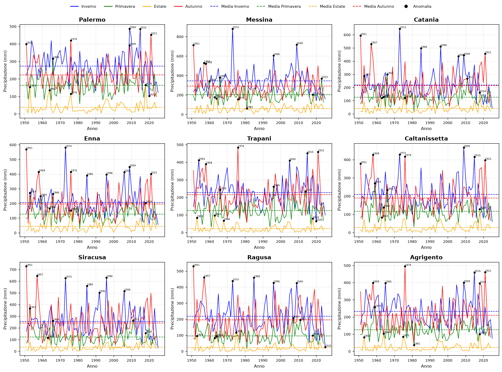
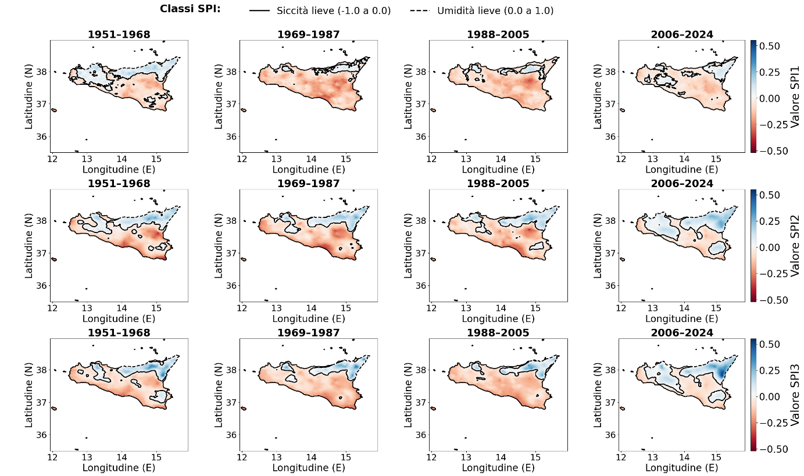
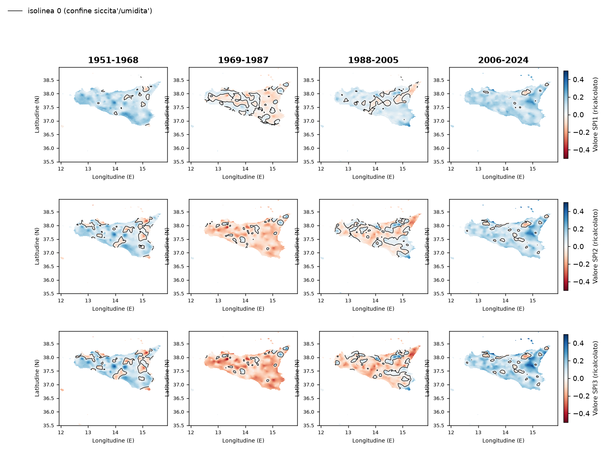
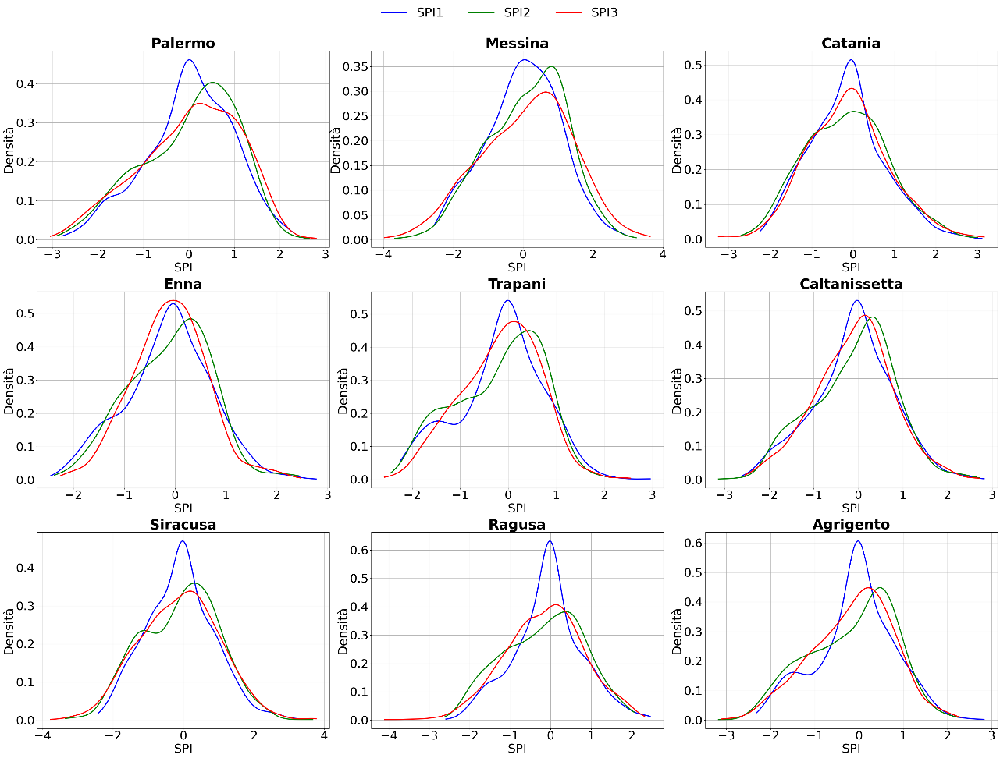
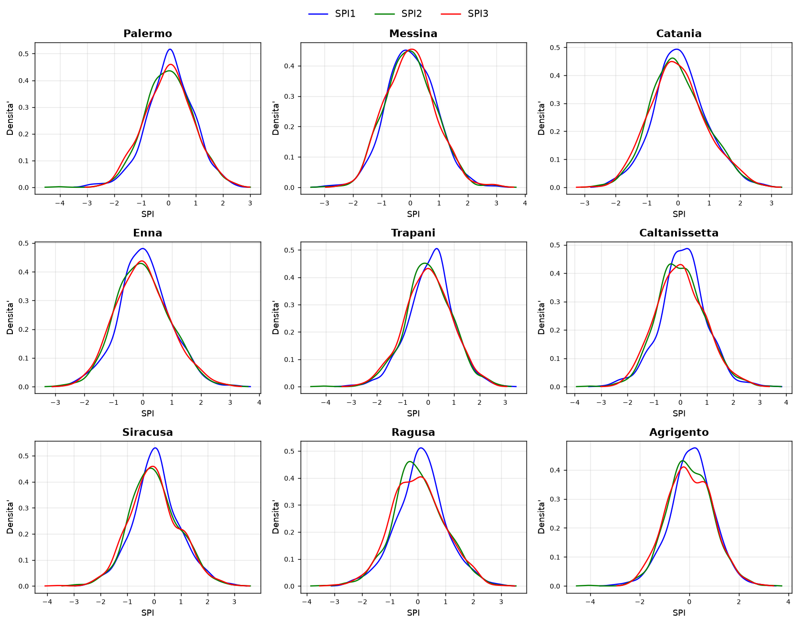
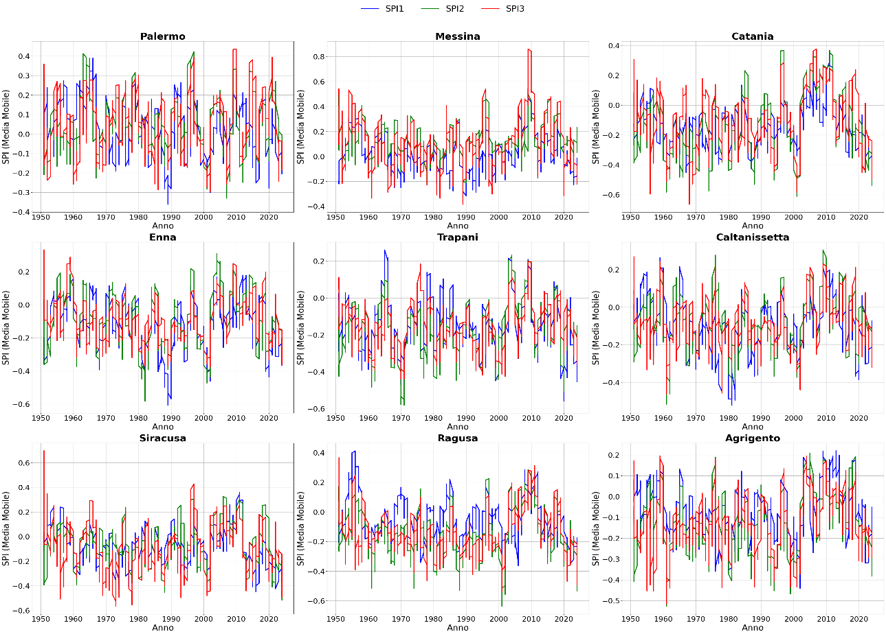
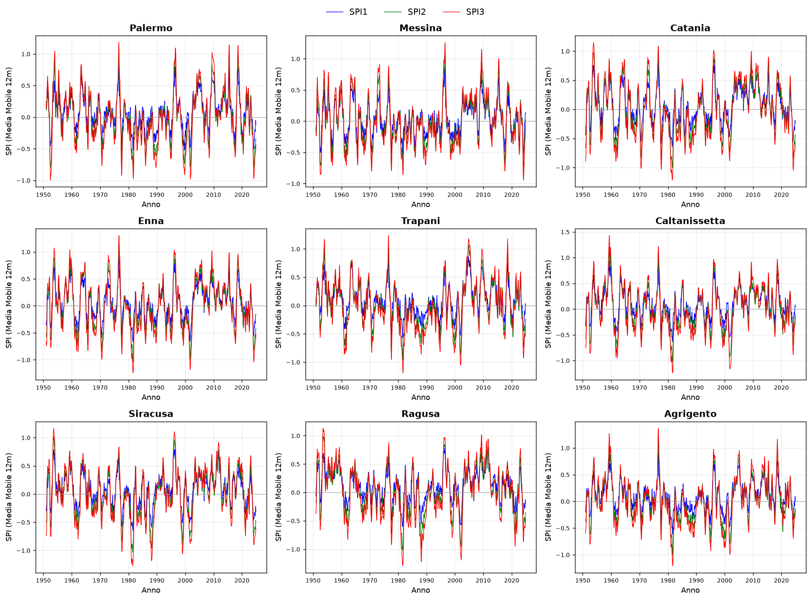

# Report di analisi — Anomalie climatiche e condizioni di siccità in Sicilia (1951–2024)

*Riproduzione delle analisi, verifica e correzione degli indici SPI, e prodotti derivati (figure, dati aperti, mappa interattiva).*

---

> **In breve.** Questo documento riproduce le analisi del report originale sulle anomalie climatiche e la siccità in Sicilia a partire dai dataset forniti, e ne verifica la solidità. Il controllo di qualità ha rilevato che i file SPI forniti (`Sicily_SPI_{1,2,3}_predicted`) **non sono indici standardizzati corretti**: conservano un marcato ciclo stagionale — che lo SPI per definizione deve rimuovere — e, per SPI1, un bias negativo con valori non fisici. Abbiamo quindi **ricalcolato** lo SPI dalla precipitazione secondo McKee et al. (1993) e le linee guida WMO (2012), ottenendo indici verificati (media ≈ 0, σ ≈ 1 per ogni mese), e li abbiamo usati per rigenerare le figure, produrre dati aperti per Datawrapper e una mappa animata interattiva. Lo SPI quantifica la **sola precipitazione**: la componente termica non è valutabile perché il dataset di temperatura non è stato fornito.

Il documento è in due parti. La **Parte I** è una nota tecnica per esperti di dominio (climatologi, idrologi, ingegneri idraulici). La **Parte II** riassume gli stessi contenuti in linguaggio divulgativo.

---

# PARTE I — Nota tecnica (esperti di dominio)

## 1. Fonti dati e ambito

Tutte le analisi partono da dataset su **griglia regolare ~1 km, passo mensile, gennaio 1951 – dicembre 2024** (382 lat × 348 lon, 888 passi temporali; ~25.300 celle ricadono in Sicilia; estensione lat 35.50–38.96 N, lon 11.94–15.91 E).

| Dato | File / origine | Stato |
|---|---|---|
| Precipitazione mensile | `Sicily_ISPRA_precip_a1951_2024.nc` (var `precip`) — ISPRA/BIGBANG | fornito |
| SPI 1 mese | `Sicily_SPI_1_predicted_…nc` (var `SPI_pred`) | fornito · con bias |
| SPI 2 mesi | `Sicily_SPI_2_predicted_…nc` (var `SPI_pred`) | fornito |
| SPI 3 mesi | `Sicily_SPI_3_predicted_…nc` (var `SPI_pred`) | fornito |
| Temperatura mensile | — | **non fornita** |
| DEM / elevazione | — | non fornito |
| Confini province | `sicilia_prov.geojson` — ISTAT / confini-amministrativi.it | integrato |
| SPI ricalcolato 1/2/3 | `Sicily_SPI_{1,2,3}_recomputed_…nc` (var `SPI`) | **prodotto qui** |

In alto i dataset forniti, in basso quelli integrati o prodotti in questa analisi. L'assenza della temperatura impedisce di riprodurre le figure termiche del report originale (Fig. 5–7) e di valutare la siccità con indici che includono la domanda evaporativa.

## 2. Pre-processing comune

- **Province.** Ogni cella della griglia è assegnata a una delle 9 province per point-in-polygon (`regionmask`) sui confini ISTAT; le serie provinciali sono medie spaziali delle celle interne. La maschera è messa in cache (`prov_mask.npy`).
- **Stagioni meteorologiche.** Inverno = DJF (dicembre attribuito all'anno successivo), Primavera = MAM, Estate = JJA, Autunno = SON.
- **Medie spaziali.** Sempre `nanmean` per cella valida: le celle no-data non vengono trattate come zero (un errore che abbasserebbe le medie, corretto in fase di verifica del totale annuo di pioggia).

## 3. Riproduzione delle figure di precipitazione

Delle 10 figure del report originale ne sono state riprodotte **7**; le 3 mancanti (Fig. 5–7, termiche) richiedono la temperatura, non disponibile. La precipitazione è integra e ha permesso di riprodurre fedelmente mappe, densità e serie.




## 4. Proprietà statistiche degli SPI forniti

Lo SPI è, per costruzione, una variabile normale standard calcolata **separatamente per ogni mese di calendario**: questo rimuove il ciclo stagionale, così che un −1 a gennaio e uno ad agosto indichino la stessa severità relativa. Media e deviazione standard devono perciò valere 0 e 1 in *ogni* mese. I file forniti violano questa proprietà.


| Mese | SPI1 fornito | SPI2 fornito | SPI3 fornito |
|---|---|---|---|
| Gennaio | −0.0 | +0.87 | +0.97 |
| Aprile | −0.57 | +0.27 | +0.44 |
| Giugno | −1.19 | −0.64 | −0.43 |
| Agosto | −0.70 | −1.48 | −1.47 |
| Dicembre | +0.07 | +0.87 | +0.75 |

*In un indice corretto la colonna sarebbe piatta a 0; qui il ciclo stagionale residuo è evidente.*

Inoltre: **SPI1** ha media globale −0.44 e σ = 0.82 (anziché 0 e 1) e varianza compressa; compaiono **valori non fisici** (fino a +12 per SPI1, −7 per SPI2), mentre uno SPI standardizzato resta quasi sempre entro ±3. Il report non documenta né il metodo di calcolo né queste proprietà. Per questo motivo lo SPI è stato ricalcolato (§5).

## 5. Correzione: ricalcolo dello SPI standard e verifica

Lo SPI è stato **ricalcolato dalla precipitazione** (`scripts/compute_spi.py`) secondo la procedura standard, per ogni scala *k* ∈ {1, 2, 3} mesi:

1. accumulo della precipitazione su finestra mobile di *k* mesi;
2. per **ogni cella e ogni mese di calendario** separatamente: frazione di accumuli nulli *q* (distribuzione mista per gli zeri) e fit di una distribuzione **Gamma** sui valori positivi con lo stimatore in forma chiusa di Thom (1958):

   *A* = ln(x̄) − ln(x)‾ ;  α = (1 + √(1 + 4A/3)) / (4A) ;  β = x̄ / α ;

3. CDF mista *H(x) = q + (1 − q)·Γ(x; α, β)* e trasformazione alla normale standard **SPI = Φ⁻¹(H(x))**.

Periodo di riferimento del fit: l'intero 1951–2024; celle/mesi con meno di 20 anni positivi non vengono fittati. **Verifiche superate** (`scripts/verify_spi.py`):

- media e deviazione standard **per ogni mese di calendario** pari a ≈ 0 e ≈ 1 (10–12 mesi su 12). L'unica deviazione attesa è in piena estate per SPI1 (luglio: media 0.43, σ 0.62), per l'eccesso di mesi a pioggia ≈ 0: limite **intrinseco e documentato** dello SPI a breve scala in clima arido, non un errore di metodo;
- frequenza delle classi di siccità in accordo con le probabilità teoriche della N(0,1) (siccità estrema 1.6–1.9 % osservato contro 2.3 % teorico);
- deviazione standard per cella compresa tra 0.94 (SPI1) e 1.00 (SPI3).

Output: `data/Sicily_SPI_{1,2,3}_recomputed_1951_2024.nc` (var `SPI`).

## 6. Confronto della siccità per periodo

| Indice | Metrica | 1951–68 | 1969–87 | 1988–2005 | 2006–24 |
|---|---|---|---|---|---|
| SPI3 | media isola | +0.07 | −0.12 | −0.06 | +0.12 |
| SPI3 | % terr. in deficit | 25 % | 92 % | 75 % | 9 % |
| SPI2 | media isola | +0.07 | −0.09 | −0.02 | +0.10 |

*Siccità per periodo con lo SPI ricalcolato (`scripts/analisi_periodi.py`): media spaziale sull'isola e quota di territorio con SPI medio di periodo < 0.*

Le stesse metriche calcolate sui file SPI forniti sono riportate per confronto in `output/data/analisi_periodi_siccita.csv`.

### 6.1 Confronto visivo: figure originali (dati forniti) vs ricalcolate

Le tre figure SPI del report originale sono messe a confronto con le stesse figure rigenerate dallo SPI ricalcolato. Il codice di tracciamento è identico: cambia solo il dataset SPI in ingresso, così il confronto isola l'effetto della correzione.

**Fig. 8 — mappe SPI per periodo**





**Fig. 9 — densità SPI per provincia**





**Fig. 10 — serie temporali SPI**





## 7. Prodotti derivati

Gli indici ricalcolati e la precipitazione integra sono stati usati per cinque prodotti:

1. **Figure rigenerate 8–10** (`scripts/fig_spi_corretto.py`): mappe per periodo, densità KDE per provincia (Fig. 9) e serie temporali a media mobile 12 mesi (Fig. 10).
2. **Analisi per periodo** (`scripts/analisi_periodi.py`): confronto sistematico ricalcolato vs fornito sui quattro periodi (§6).
3. **Dati aperti per Datawrapper** (`scripts/datawrapper_csv.py`, 5 CSV `A–E`): cronologia SPI sull'isola, quota di territorio in deficit per periodo, anomalia SPI3 per provincia/periodo, regime mensile delle piogge e pioggia annuale (media di lungo periodo 576 mm).
4. **Mappa animata interattiva** (`scripts/build_map_animation.py`), descritta sotto.
5. **Dataset NetCDF ricalcolato** riusabile da terzi, con verifica di qualità allegata (CSV `verify_A…D`).

### 7.1 Pipeline della mappa animata

Il file `output/web/sicilia_siccita.html` è un widget autosufficiente (~1.35 MB, nessuna dipendenza né chiamata di rete) che anima pioggia e SPI dal 1951 al 2024. La pipeline di costruzione:

- **Variabili e lisciatura:** anomalia % di pioggia e SPI 1/2/3, tutte a **media mobile 12 mesi** per leggibilità.
- **Riduzione spaziale:** ritaglio sulla Sicilia e *downsampling* per blocchi (`nanmean`) a griglia di larghezza ~140 px; la terraferma viene *dilatata* di alcune celle e le nuove celle ereditano il valore della cella valida più vicina (distance-transform), così la costa non resta frastagliata — il disegno è poi *ritagliato* sul contorno reale.
- **Fotogrammi:** uno ogni 6 mesi (`STRIDE=6`); l'animazione fluida nasce da *interpolazione lineare nel browser* tra fotogrammi adiacenti.
- **Codifica compatta:** valori quantizzati a `uint8` su un intervallo fisso per variabile, *delta-encoding per cella* (gzip-friendly), poi `gzip` livello 9 e `base64` dentro l'HTML. Nel browser la decompressione usa `DecompressionStream`.
- **Resa:** disegno su `<canvas>` con palette divergente rosso–blu, *clipping* sul contorno costiero (unione delle province semplificata), supporto HiDPI e *auto-altezza* in `iframe` via `postMessage`.

Il widget si incorpora con un semplice `<iframe>` (istruzioni in `output/web/COME_INCORPORARE.md`).

## 8. Limiti e avvertenze

Lo SPI quantifica **esclusivamente la precipitazione**: non cattura la siccità agricola o idrologica legata all'aumento delle temperature e dell'evapotraspirazione, componente **non verificabile** in assenza del dataset di temperatura. Indici che includono la domanda evapotraspirativa (es. **SPEI**) sarebbero più adatti a coglierla.

## 9. Riproducibilità

I file NetCDF (~3.3 GB) non sono versionati (vedi `.gitignore`); gli SPI ricalcolati si rigenerano da `compute_spi.py`. Script principali in `scripts/`, output in `output/` (figure, `output/data/` CSV diagnostici, `output/datawrapper/` CSV per i grafici, `output/web/` mappa animata).

```bash
# ambiente (uv)
uv venv /tmp/climenv --python 3.12
VIRTUAL_ENV=/tmp/climenv uv pip install numpy pandas xarray netCDF4 \
  matplotlib scipy geopandas shapely regionmask
# ricalcolo SPI, verifica, analisi per periodo, figure rigenerate, dati e mappa
P=/tmp/climenv/bin/python3
$P scripts/compute_spi.py
$P scripts/verify_spi.py
$P scripts/analisi_periodi.py
$P scripts/fig_spi_corretto.py
$P scripts/datawrapper_csv.py
$P scripts/build_map_animation.py
```

**Riferimenti.** McKee, Doesken & Kleist (1993), *The relationship of drought frequency and duration to time scales*, 8th Conf. Applied Climatology. · Thom (1958), *A note on the gamma distribution*, Monthly Weather Review 86(4). · WMO (2012), *Standardized Precipitation Index User Guide* (WMO-No. 1090).

---

# PARTE II — In parole semplici

## Cosa abbiamo guardato

Abbiamo studiato **quanta pioggia è caduta in Sicilia, mese per mese, dal 1951 al 2024** — quasi 74 anni — su una griglia fittissima che copre tutta l'isola con quadretti di circa un chilometro di lato, per misurare quando e dove c'è stata siccità a partire dai dati di pioggia.

## Da dove vengono i dati

Ci sono stati forniti due tipi di dati: la **pioggia misurata** (un archivio ISPRA molto dettagliato) e un **"indice di siccità"** già calcolato, chiamato SPI, che dovrebbe dire con un solo numero se un periodo è più secco o più umido del solito. Ai confini delle 9 province ci abbiamo pensato noi, scaricandoli dall'ISTAT.

## Il problema che abbiamo trovato (e sistemato)

L'indice di siccità che ci è stato dato era **tarato male**. Funziona un po' come un termometro che, d'estate, segna sempre "freddo" solo perché si aspetta che faccia caldo: così un luglio normale veniva etichettato come "secco" soltanto perché a luglio in Sicilia piove poco *per natura*. Un buon indice di siccità deve invece togliere di mezzo le differenze fra le stagioni e dire se un mese è secco *rispetto a quanto è normale per quel mese*.

Per questo lo abbiamo **ricalcolato da zero** partendo dalla pioggia, seguendo il metodo scientifico standard riconosciuto a livello internazionale (McKee 1993, linee guida dell'Organizzazione Meteorologica Mondiale). Poi lo abbiamo **verificato**: ora i numeri si comportano come devono in ogni mese dell'anno.

## La mappa che si muove

Per raccontare tutto questo in modo immediato abbiamo costruito una **mappa animata** della Sicilia che scorre dal 1951 al 2024: si vede l'isola colorarsi di rosso quando è secca e di blu quando è umida, con un cursore per spostarsi nel tempo e tre indici selezionabili (pioggia e siccità a 1 e 3 mesi). È un unico file che funziona in qualsiasi pagina web, anche da telefono, senza scaricare nulla da internet.

## L'avvertenza onesta

Tutto questo riguarda **solo la pioggia**. Ma la siccità dipende anche dal **caldo**: con temperature più alte l'acqua evapora di più e il terreno si secca anche se piove normalmente. Non abbiamo potuto tenerne conto perché **il dato sulle temperature non ci è stato fornito**. Per includerlo servirebbe un indice che mette insieme pioggia *e* temperatura (lo SPEI).
