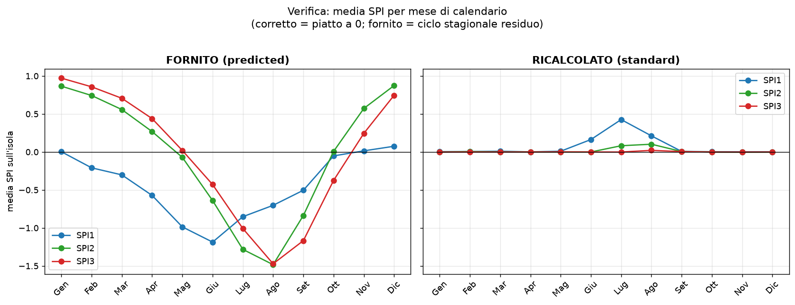

# Report di verifica — Controlli di qualità sui dati SPI forniti (Sicilia, 1951–2024)

*Quali test sono stati eseguiti, quali numeri sono stati verificati, perché non dovrebbero comparire in uno SPI, e come vengono corretti col ricalcolo.*

---

> **Oggetto.** I file `Sicily_SPI_{1,2,3}_predicted` (variabile `SPI_pred`) vengono usati e letti come *indici SPI standardizzati*. Questo report sottopone quei file a tre test oggettivi e falsificabili, derivati dalla definizione stessa dello SPI, riportando i numeri misurati direttamente dai file NetCDF. I file forniti **non superano nessuno dei tre test**, con scarti molto maggiori del rumore di campionamento. Lo SPI ricalcolato dalla precipitazione supera tutti e tre i test. Segue una lista operativa dei punti da ricontrollare nella pipeline che ha generato i file.

## 1. Cosa deve valere per uno SPI (criteri verificabili)

Lo SPI (McKee et al. 1993; WMO 2012) è, per costruzione, una variabile **normale standard calcolata separatamente per ogni mese di calendario**. Da questa definizione discendono tre proprietà **misurabili e falsificabili**:

- **P1 — Standardizzazione per mese.** Media ≈ 0 e deviazione standard ≈ 1 per *ciascun* mese di calendario (gennaio, febbraio, …), non solo in aggregato.
- **P2 — Code fisiche e simmetria.** Essendo una z-score N(0,1): |SPI| > 3 nello 0.27 % dei casi, |SPI| > 4 nello 0.006 %; valori oltre ±5 praticamente assenti; distribuzione simmetrica.
- **P3 — Frequenza delle classi.** Le classi di siccità devono ricorrere con le probabilità della N(0,1) (es. siccità estrema ≤ −2: 2.3 %).

**Soglia di tolleranza (importante).** Su un record finito di 74 anni la media mensile non sarà mai esattamente 0: c'è un rumore di campionamento dell'ordine di 1/√74 ≈ 0.12 per cella, ridotto dalla media spaziale. Non si pretende quindi lo "0 esatto": uno scarto di ±0.1–0.2 è normale. La prova empirica di questo pavimento di rumore è lo **SPI ricalcolato**, che sullo stesso record resta entro ±0.10 in 11 mesi su 12 (§4). Gli scarti dei file forniti, fino a 1.5, sono **~15 volte** questo livello: non sono rumore, sono un segnale strutturale.

## 2. Test eseguiti (riproducibili)

I file sono stati aperti grezzi (variabile `SPI_pred`, *senza* alcun ri-centraggio) e sottoposti a:

- **Test A** → media e deviazione standard per ogni mese di calendario (verifica P1).
- **Test B** → statistiche globali, minimo, massimo e frequenza delle code (verifica P2).
- **Test C** → frequenza delle classi di siccità contro le probabilità N(0,1) (verifica P3).

Gli stessi test sono stati applicati allo SPI ricalcolato come controprova. Numeri prodotti con `scripts/verify_spi.py` e con gli script di controllo in appendice.

## 3. Numeri verificati sui file forniti, e perché non dovrebbero esserci

### 3.1 Test A — ciclo stagionale residuo (viola P1)

La media dell'indice fornito, calcolata mese per mese sull'isola, **non è piatta a 0**:

| | gen | feb | mar | apr | mag | giu | lug | ago | set | ott | nov | dic |
|---|---|---|---|---|---|---|---|---|---|---|---|---|
| **SPI1** | +0.00 | −0.21 | −0.30 | −0.57 | −0.99 | **−1.19** | −0.85 | −0.70 | −0.50 | −0.05 | +0.01 | +0.07 |
| **SPI2** | **+0.87** | +0.74 | +0.56 | +0.27 | −0.07 | −0.64 | −1.28 | **−1.48** | −0.84 | +0.01 | +0.57 | +0.87 |
| **SPI3** | **+0.97** | +0.86 | +0.71 | +0.44 | +0.02 | −0.43 | −1.01 | **−1.47** | −1.17 | −0.37 | +0.25 | +0.75 |

*Media mensile dell'SPI **fornito**. In uno SPI corretto ogni valore sarebbe ≈ 0; qui si va da +1.0 (inverno) a −1.5 (estate). La deviazione standard per mese, inoltre, è 0.6–0.8 anziché 1 (varianza compressa).*

**Perché non dovrebbe esserci.** Lo SPI rimuove la stagionalità *per definizione*: serve proprio a rendere confrontabili mesi diversi. Una media di −1.5 ad agosto significa che, per costruzione, *l'agosto medio cade nella classe "siccità severa"*: metà degli agosti della serie risulterebbe siccitosa solo perché è agosto, e ogni gennaio risulterebbe umido. L'indice sta misurando la stagione, non l'anomalia — il contrario del suo scopo. Lo scarto (~1.5) è circa 15 volte il rumore atteso (~0.1).



### 3.2 Test B — code non fisiche e bias (viola P2)

| File | media | σ | min | max | \|SPI\|>4 |
|---|---|---|---|---|---|
| SPI1 fornito | **−0.44** | 0.82 | −6.3 | **+12.1** | 0.034 % |
| SPI2 fornito | −0.04 | 1.02 | −7.2 | **+9.1** | 0.059 % |
| SPI3 fornito | −0.04 | 1.06 | −7.3 | **+11.8** | **0.169 %** |
| — atteso N(0,1) — | 0 | 1 | — | — | 0.006 % |

*Massimi di +9…+12 sono incompatibili con una z-score: P(N(0,1) > 12) ≈ 10⁻³³. Le code oltre ±4 sono fino a 27 volte più frequenti del previsto. SPI1 ha anche un bias medio di −0.44.*

**Perché non dovrebbe esserci.** In uno SPI corretto un valore di +12 è di fatto impossibile; la sua presenza indica che la trasformazione alla normale non è andata a buon fine (o che l'indice non è una z-score). Il bias di −0.44 su SPI1 sposta sistematicamente l'intera serie verso il "secco".

### 3.3 Test C — frequenza delle classi sbilanciata (viola P3)

| Classe | teorica | SPI1 fornito | SPI3 fornito |
|---|---|---|---|
| siccità severa (da −2 a −1.5) | 4.4 % | **8.1 %** | 5.2 % |
| siccità moderata (da −1.5 a −1) | 9.2 % | **14.4 %** | 9.4 % |
| umido marcato (oltre +1) | 15.9 % | **3.0 %** | 14.6 % |

*Frequenza di alcune classi nei file forniti vs probabilità N(0,1). SPI1 è fortemente asimmetrico: la classe "umido marcato" compare nel 3 % dei casi invece del 16 % atteso, e le classi secche sono sovra-rappresentate — coerente col bias e con la varianza compressa.*

## 4. Come vengono ricalcolati (e perché passano i test)

Lo SPI è stato **ricalcolato dalla precipitazione** (`scripts/compute_spi.py`) secondo la procedura standard: accumulo a *k* mesi; per *ogni cella e ogni mese di calendario* fit di una Gamma (stimatore di Thom 1958) sui valori positivi con gestione mista degli zeri; trasformazione SPI = Φ⁻¹(H(x)); periodo di riferimento 1951–2024. Gli stessi tre test, applicati al risultato:

| Test | criterio | SPI1 ric. | SPI2 ric. | SPI3 ric. |
|---|---|---|---|---|
| A — max \|media mese\| | ≤ ~0.1 | 0.43\* | 0.10 | 0.02 |
| B — max valore | < ~5 | +4.4 | +4.8 | +4.7 |
| B — \|SPI\|>4 (teor. 0.006 %) | ≈ teor. | 0.013 % | 0.038 % | 0.006 % |
| C — estrema ≤ −2 (teor. 2.3 %) | ≈ teor. | 1.6 % | 1.7 % | 1.9 % |

*\*L'unica eccezione, luglio SPI1 (+0.43), è un limite **noto e documentato** dello SPI a 1 mese in clima arido (troppi mesi a pioggia ≈ 0, il fit Gamma degenera); sparisce a 2 e 3 mesi.*

Per mese di calendario lo SPI ricalcolato resta entro ±0.10 (11 mesi su 12): è questo che fissa empiricamente il "pavimento di rumore" usato come soglia al §1.

## 5. Checklist: cosa ricontrollare nella pipeline di Amir

I sintomi misurati indicano alcune cause probabili. Da verificare, in ordine:

1. **Il fit è stato fatto separatamente per ogni mese di calendario?** Il ciclo stagionale residuo (Test A) è il sintomo tipico di un fit eseguito su *tutti i mesi insieme* (o di una climatologia non rimossa). È il punto più importante.
2. **La variabile si chiama `SPI_pred`: è l'uscita di un modello predittivo?** In tal caso la standardizzazione non è garantita a valle del modello: l'output va ri-standardizzato per mese, oppure lo SPI va calcolato direttamente dalla precipitazione.
3. **È documentato il periodo di riferimento del fit?** (climatologia 1951–2024 o altro).
4. **Quale distribuzione e quale gestione degli zeri?** Per la pioggia mensile serve una Gamma (o simili) con trattamento misto degli zeri; una normale diretta produce code e bias come quelli osservati.
5. **Ci sono controlli sui valori estremi?** Massimi di +12 vanno intercettati da un QC (clip ragionevole a ±3.5–4 e ispezione delle celle anomale).
6. **Verifica a posteriori obbligatoria:** ripetere i Test A/B/C su qualunque nuova versione prima di pubblicarla.

## 6. Conclusione

I file SPI forniti falliscono tutte e tre le proprietà che definiscono uno SPI (standardizzazione per mese, code fisiche, frequenza delle classi), con scarti di un ordine di grandezza superiori al rumore di campionamento. Non si tratta di pretendere lo "0 esatto": lo scarto è ~1.5 contro un rumore atteso di ~0.1. Il ricalcolo dalla precipitazione riporta tutti gli indicatori nei limiti attesi. Prima di utilizzare lo SPI della versione originale è necessario ricontrollare i punti del §5.

---

**Riferimenti.** McKee, Doesken & Kleist (1993), 8th Conf. Applied Climatology. · Thom (1958), Monthly Weather Review 86(4). · WMO (2012), *Standardized Precipitation Index User Guide* (WMO-No. 1090).

**Appendice — riprodurre i test.** Con l'ambiente di progetto:

```bash
P=/tmp/climenv/bin/python3
$P scripts/verify_spi.py          # Test A/B/C su ricalcolato + confronto fornito
# output: output/data/verify_A..D_*.csv
```
