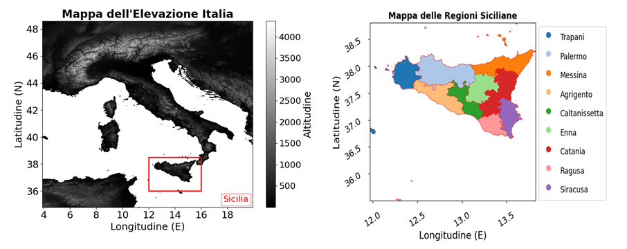
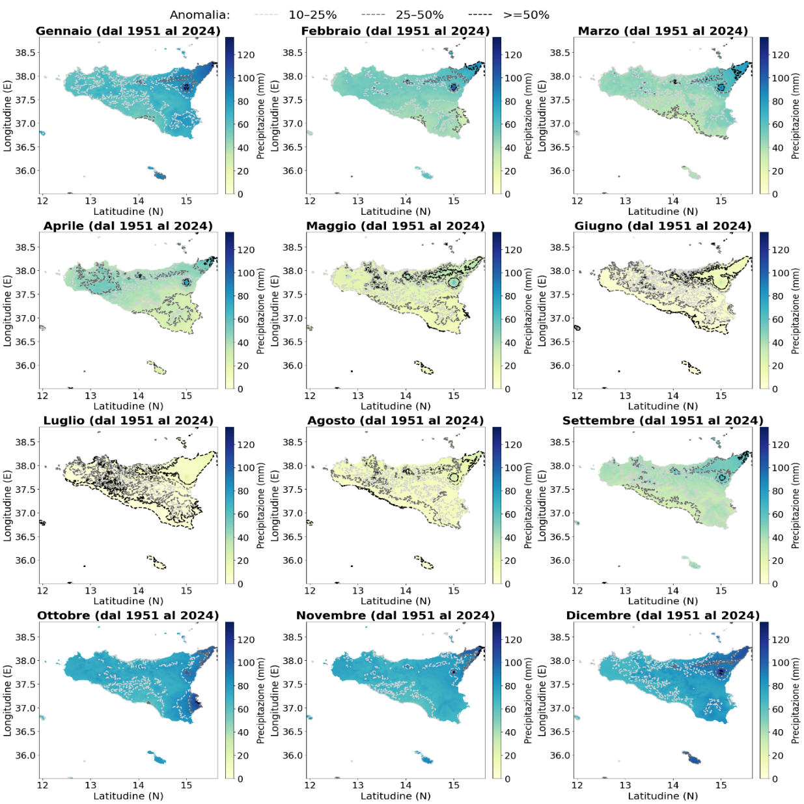
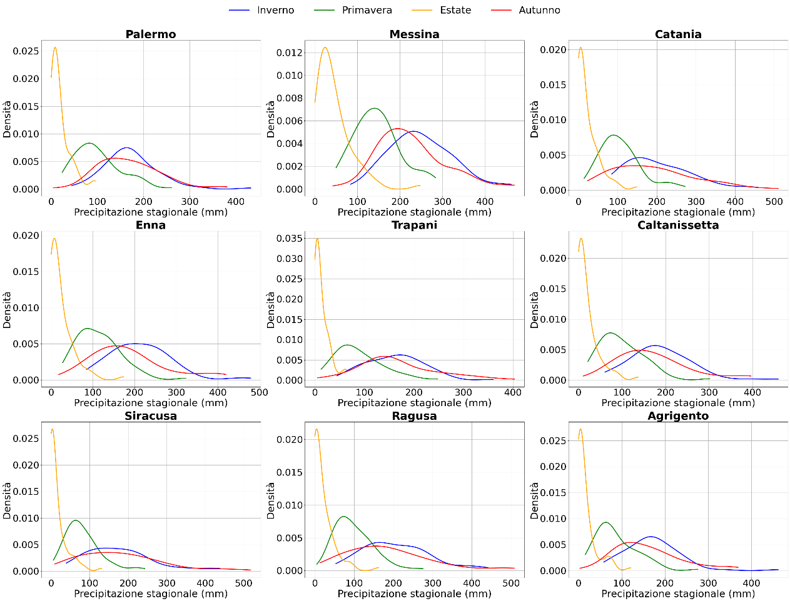
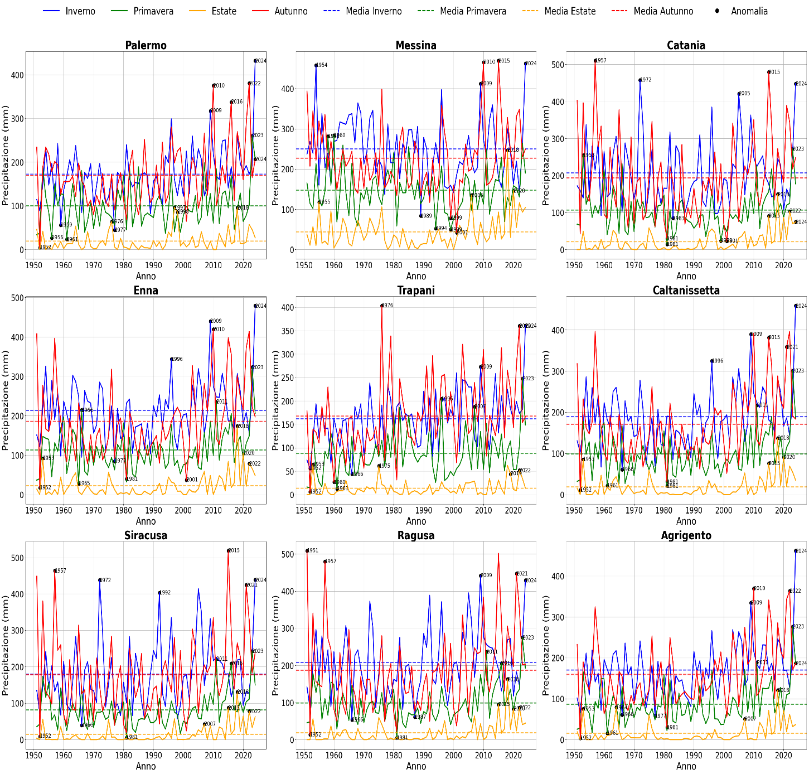
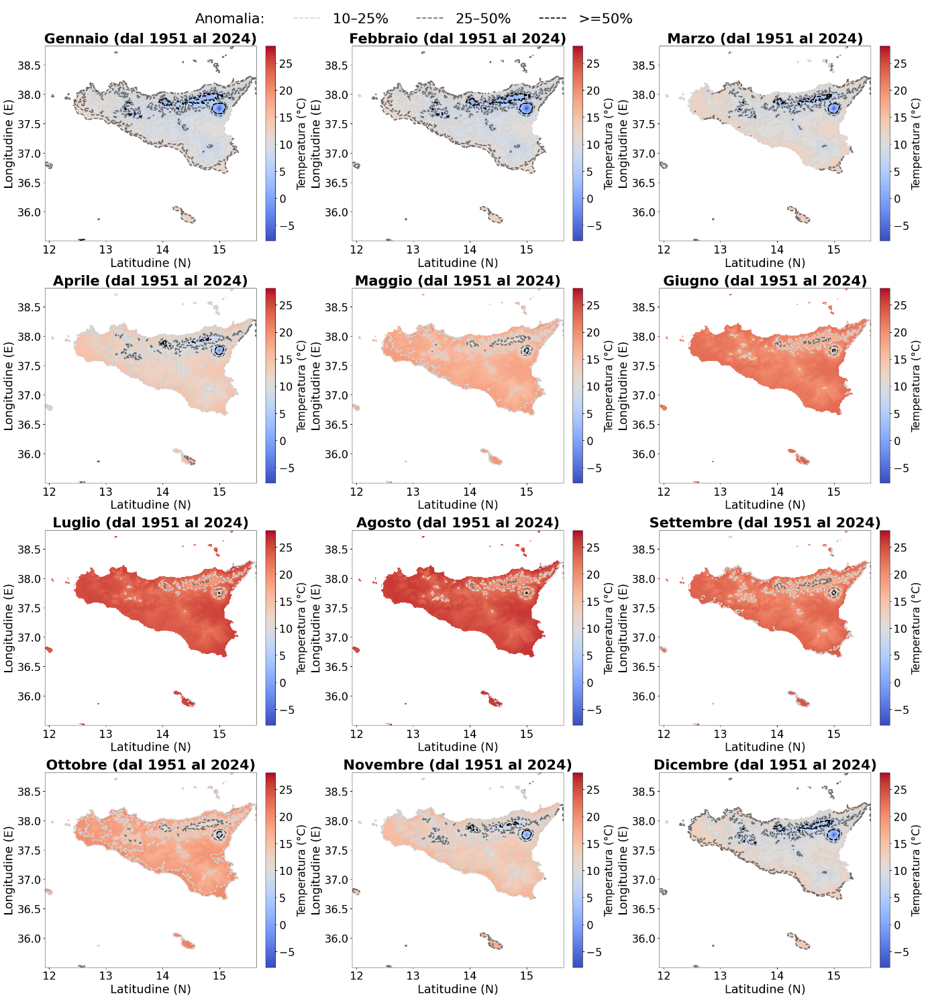
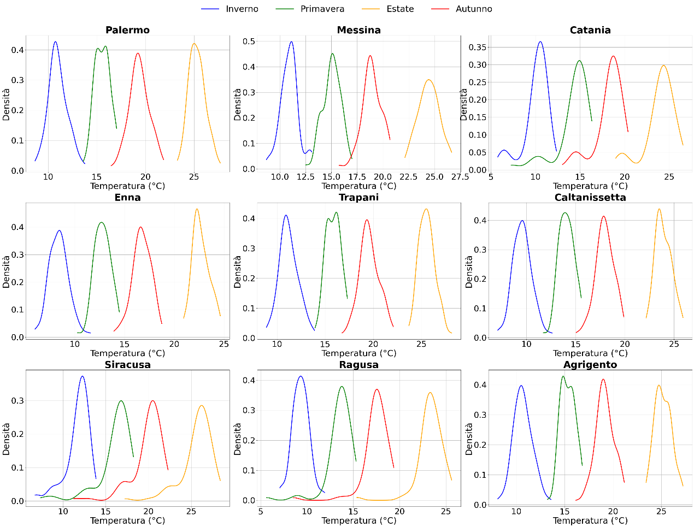
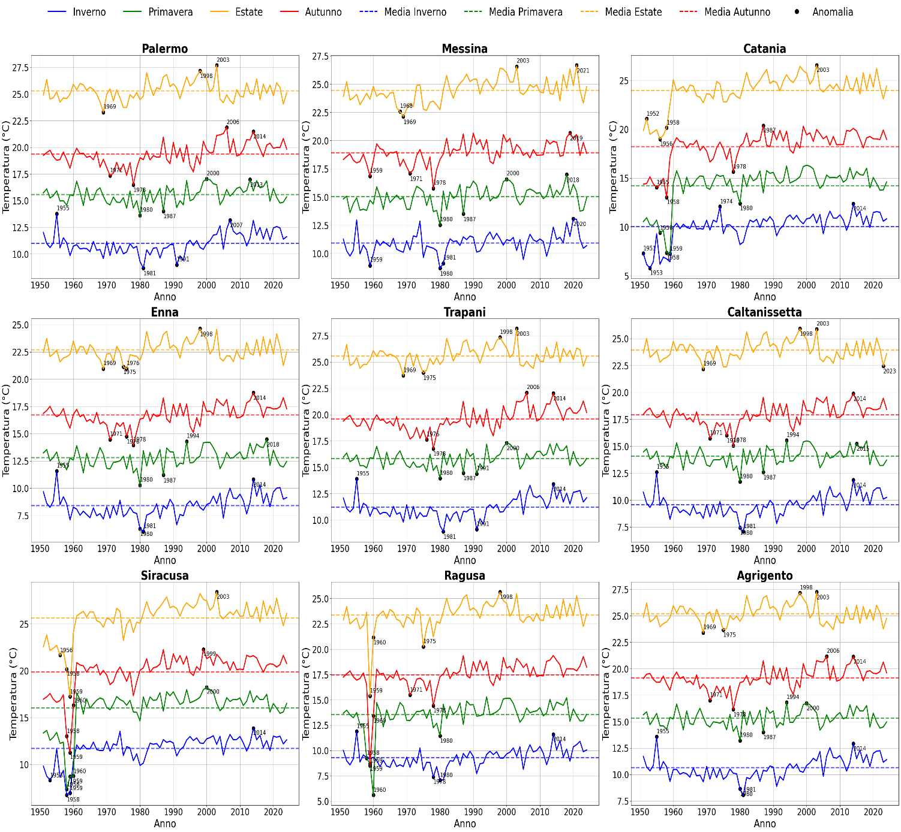

# Valutazione dei Cambiamenti Climatici e Rilevamento delle Anomalie nella Regione Siciliana tra il 1951 e il 2024

> ***Sintesi.** Questo studio analizza la variabilità climatica di lungo periodo e l’evoluzione della siccità in Sicilia dal 1951 al 2024 utilizzando dataset ad alta risoluzione di temperatura e precipitazione, integrati con indici standardizzati di siccità. L’analisi evidenzia cambiamenti spaziali e temporali significativi nel regime idro‑climatico dell’isola, tra cui una riduzione delle precipitazioni in diverse province, forti contrasti orografici nella distribuzione stagionale delle piogge e un persistente trend di riscaldamento che si intensifica soprattutto in estate e tarda primavera. Le valutazioni basate sullo SPI mostrano una transizione progressiva da condizioni prevalentemente umide o quasi normali nella metà del XX secolo a siccità diffuse e persistenti dopo gli anni 2000, in particolare nelle aree interne e occidentali. Nel complesso, i risultati indicano una sostanziale riorganizzazione del sistema climatico siciliano, guidata da processi di riscaldamento e aridificazione di lungo periodo, e mettono in evidenza la crescente vulnerabilità della regione alla scarsità idrica. Lo studio fornisce inoltre un quadro quantitativo utile per comprendere e monitorare tali cambiamenti, offrendo indicazioni rilevanti per la gestione delle risorse idriche e la pianificazione di strategie di adattamento climatico.*

## 1. Introduzione

L’Italia si trova all’interno del Bacino del Mediterraneo, una regione ampiamente riconosciuta come hotspot dei cambiamenti climatici, dove il riscaldamento, la variabilità idro‑climatica e la scarsità idrica stanno aumentando più rapidamente rispetto alla media globale (Legg, 2021; Lionello & Scarascia, 2018). Negli ultimi decenni, dataset osservativi e prodotti di rianalisi hanno documentato un chiaro aumento delle temperature dell’aria, una tendenza alla diminuzione delle precipitazioni in diverse aree e un marcato incremento della frequenza e della persistenza di eventi estremi come ondate di calore e siccità (Brunetti et al., 2004; Toreti et al., 2013). Questi cambiamenti hanno implicazioni dirette sulla disponibilità idrica, poiché le modifiche nei regimi delle precipitazioni, la riduzione dell’accumulo nevoso e l’aumento dell’evapotraspirazione riducono complessivamente l’affidabilità delle risorse idriche del Paese (Rossi & Cancelliere, 2002).

A livello nazionale, l’Istituto Superiore per la Protezione e la Ricerca Ambientale (ISPRA) fornisce uno dei quadri di monitoraggio climatico più completi in Europa. Attraverso il sistema SCIA e i bollettini climatici e di siccità, ISPRA mette a disposizione serie storiche di temperatura e precipitazione, indici standardizzati di siccità come lo SPI e indicatori idrologici utili per quantificare la variabilità climatica e valutare l’evoluzione delle condizioni siccitose in Italia (ISPRA, n.d.). Queste valutazioni mostrano costantemente un aumento della frequenza e dell’estensione spaziale delle siccità meteorologiche e idrologiche, in particolare nelle regioni centrali e meridionali, dove la scarsità idrica rappresenta già una criticità strutturale.

A complemento delle osservazioni nazionali, il Centro Euro‑Mediterraneo sui Cambiamenti Climatici (CMCC) ha sviluppato simulazioni climatiche ad alta risoluzione e valutazioni di impatto che evidenziano l’intensificazione dei rischi idro‑climatici in condizioni di cambiamento climatico in atto e futuro (Navarra & Tubiana, 2013; Bucchignani et al., 2016). Le proiezioni del CMCC indicano che l’Italia meridionale e le principali isole sperimenteranno probabilmente un riscaldamento più intenso, una riduzione delle precipitazioni e episodi siccitosi più persistenti, soprattutto negli scenari ad alte emissioni. Questi risultati sono coerenti con le valutazioni mediterranee più ampie, che identificano la regione come una delle più vulnerabili alla futura scarsità idrica, con attese riduzioni delle risorse idriche rinnovabili e una crescente competizione tra settori quali agricoltura, energia e uso domestico (Legg, 2021).

In questo contesto nazionale e mediterraneo, la Sicilia rappresenta un caso particolarmente sensibile. L’isola presenta forti gradienti spaziali nella topografia, nella distribuzione delle precipitazioni e nell’esposizione ai sistemi di circolazione atmosferica, che determinano una marcata variabilità climatica (Liuzzo et al., 2016). Studi recenti basati su indici standardizzati di siccità hanno evidenziato cambiamenti significativi nella frequenza, durata e severità degli episodi siccitosi in Sicilia, con diverse subregioni, in particolare le aree interne e occidentali, che mostrano un chiaro spostamento verso condizioni più persistentemente secche (Aschale et al., 2024). Questi modelli in evoluzione incidono direttamente sulla scarsità idrica, aumentando la pressione su invasi, sistemi idrici sotterranei e domanda agricola, e accrescendo la vulnerabilità delle comunità locali e degli ecosistemi.

## 2. Area di studio e fonti dati

La Sicilia è la più grande isola del Mar Mediterraneo, situata approssimativamente tra 36° e 38.5°N di latitudine e 12° e 16°E di longitudine, e collocata all’interfaccia tra le influenze climatiche temperate europee e quelle semi‑aride nordafricane. Questa posizione geografica contribuisce a una marcata variabilità spaziale della temperatura, delle precipitazioni e dei modelli di circolazione atmosferica sull’isola. La fisiografia siciliana è altamente eterogenea, con ampie pianure costiere, aree collinari interne e diversi importanti sistemi montuosi, tra cui le Madonie, i Nebrodi e il massiccio dell’Etna, che raggiunge i 3.329 m e esercita una forte influenza sui microclimi locali e sulla distribuzione delle precipitazioni (Cammalleri et al., 2010). I gradienti altitudinali svolgono un ruolo centrale nel modellare i regimi pluviometrici, con i settori montuosi nord‑orientali che ricevono precipitazioni significativamente più elevate rispetto alle aree meridionali e occidentali, più aride. Dal punto di vista amministrativo, la Sicilia è suddivisa in nove province: Trapani, Palermo, Messina, Agrigento, Caltanissetta, Enna, Catania, Ragusa e Siracusa. Queste subregioni presentano differenze marcate in termini di geomorfologia, uso del suolo e caratteristiche climatiche, che influenzano le loro risposte idrologiche e il grado di vulnerabilità alla siccità. Le analisi a lungo termine delle tendenze pluviometriche mostrano una generale diminuzione delle precipitazioni in diverse parti dell’isola, accompagnata da un aumento della variabilità interannuale e da periodi siccitosi più frequenti (Brunetti et al., 2004; Liuzzo et al., 2016).

**Figura 1.** Mappatura spaziale della Sicilia a una risoluzione di 1 km, con rappresentazione dei pattern altimetrici e della suddivisione amministrativa regionale, basata su dati riferiti al sistema di coordinate WGS84.

La combinazione di una topografia complessa, forti gradienti climatici e tendenze semi‑aride in molte aree rende la Sicilia particolarmente sensibile allo stress idro‑climatico. Studi recenti basati su indici standardizzati di siccità, come lo SPI, confermano una chiara intensificazione delle condizioni siccitose sull’isola, con diverse province, soprattutto quelle interne e occidentali, che mostrano un passaggio verso periodi secchi più persistenti e severi (Aschale et al., 2024). Questi modelli in evoluzione aumentano la pressione sulle risorse idriche, interessando invasi, sistemi idrici sotterranei e domanda agricola, e rafforzano la vulnerabilità dell’isola alla scarsità idrica. Considerate queste caratteristiche, la Sicilia rappresenta un caso di studio ideale per analizzare la variabilità climatica, individuare anomalie e valutare l’evoluzione spaziale e temporale della siccità in condizioni climatiche in cambiamento.

### 2.1 Dati

Il dataset utilizzato in questo lavoro è il dataset climatico mensile ISPRA BIGBANG, un prodotto grigliato ad alta risoluzione che fornisce serie temporali di precipitazione e temperatura con una risoluzione spaziale di 1 km sull’intero territorio italiano. Sviluppato da ISPRA attraverso la piattaforma BIGBANG Data Groupware (<https://www.isprambiente.gov.it/pre_meteo/idro/BIGBANG_ISPRA.htm> l), il dataset integra osservazioni provenienti da reti meteorologiche nazionali e regionali, applicando rigorose procedure di controllo qualità, omogeneizzazione e interpolazione spaziale per garantire la coerenza temporale a partire dal 1951. Questa ricostruzione ad alta risoluzione cattura gradienti climatici di dettaglio, particolarmente rilevanti in contesti complessi come le fasce costiere, i bacini interni e i settori montuosi della Sicilia, consentendo analisi robuste della variabilità climatica di lungo periodo e dell’evoluzione della siccità. La frequenza temporale mensile e il dettaglio spaziale rendono il dataset ISPRA BIGBANG una risorsa fondamentale per il calcolo di indicatori standardizzati di siccità come lo **SPI**, per la valutazione delle tendenze idro‑climatiche e per supportare la pianificazione delle risorse idriche su scala regionale in un contesto di cambiamento climatico.

## 3. Risultati e Discussione

I risultati presentati in questa sezione offrono un’analisi sintetica dell’evoluzione delle precipitazioni, delle temperature e degli indicatori di siccità in Sicilia dal 1951 al 2024, mettendo in evidenza i principali pattern spaziali e temporali che caratterizzano il regime idro‑climatico dell’isola in cambiamento. La Figura 2 mostra la distribuzione spaziale delle anomalie mensili medie di precipitazione in Sicilia per il periodo 1951–2024, rivelando un chiaro ciclo stagionale sia nell’intensità delle piogge sia nella struttura delle linee di anomalia: durante l’autunno e l’inverno, le linee di anomalia del 10–25%, 25–50% e ≥50% risultano dense e concentrate lungo le catene montuose settentrionali e nord‑orientali, indicando forti deviazioni positive dovute all’effetto orografico, mentre le aree meridionali e sud‑orientali mostrano sistematicamente anomalie più deboli o negative; con l’avanzare della primavera, tali contorni si indeboliscono e si contraggono progressivamente, riflettendo una riduzione dei contrasti spaziali e la transizione verso condizioni più secche; in estate, la quasi totale assenza di linee di anomalia evidenzia un regime uniformemente arido su tutta l’isola; infine, da settembre in poi, la ricomparsa e l’intensificazione dei contorni di anomalia nelle aree montuose settentrionali segnano l’inizio della stagione umida e la ri‑affermazione del caratteristico gradiente pluviometrico nord‑sud.

**Figura 2.** Mappatura spaziale della precipitazione mensile media nel periodo 1951–2024 nella regione Sicilia, a una risoluzione di 1 km, seguita dalla distribuzione delle anomalie di precipitazione. derivate dal dataset ISPRA.

Come mostrato in Figura 3, le distribuzioni di densità evidenziano marcati contrasti stagionali nelle precipitazioni in tutte le subregioni siciliane. L’inverno e l’autunno presentano i quantitativi più elevati e la variabilità più ampia, con valori che raggiungono generalmente 150–300 mm a seconda dell’area. In queste stagioni compaiono curve larghe e talvolta multimodali, in particolare nelle province di Palermo, Messina ed Enna, indicando una forte variabilità interannuale e la ricorrenza di eventi piovosi intensi.

La primavera mostra densità intermedie, in genere comprese tra 80 e 150 mm, con distribuzioni più strette che riflettono un comportamento stagionale più stabile. L’estate, invece, è caratterizzata da una distribuzione fortemente asimmetrica verso valori molto bassi, per lo più inferiori a 20–40 mm, confermando la persistenza del tipico regime secco mediterraneo e la scarsa variabilità tra le diverse subregioni.

Le province costiere, come Trapani e Siracusa, tendono a mostrare distribuzioni invernali e autunnali leggermente più strette, mentre le aree montuose interne, come Enna e Caltanissetta, presentano gamme più ampie, sottolineando il ruolo dell’orografia nell’amplificare gli estremi pluviometrici stagionali.

Nel complesso, la Figura 4 evidenzia come inverno e autunno rappresentino le stagioni che maggiormente contribuiscono alla variabilità spaziale e temporale delle precipitazioni in Sicilia, mentre l’estate rimane costantemente secca e la primavera occupa una posizione intermedia, con un regime più stabile.

**Figura 3.** Distribuzioni di densità della precipitazione stagionale per nove subregioni siciliane, che illustrano gli intervalli tipici e la variabilità delle piogge in inverno, primavera, estate e autunno nel periodo 1951–2024.

La Figura 4 mette in evidenza cambiamenti chiari e quantificabili nelle anomalie di precipitazione stagionale nelle subregioni siciliane tra il 1951 e il 2024, con diversi decenni che mostrano scostamenti statisticamente significativi rispetto alla media di lungo periodo. Le anomalie invernali presentano l’ampiezza maggiore, con picchi positivi che superano spesso +40–60 mm nelle aree settentrionali, come Palermo e Messina, in particolare durante le fasi umide degli anni Settanta e dei primi anni Novanta. Al contrario, forti anomalie invernali negative, frequentemente comprese tra –30 e –50 mm, compaiono nelle subregioni centrali e meridionali durante i periodi dominati dalla siccità negli anni Ottanta e Duemila.

La primavera e l’autunno mostrano deviazioni moderate ma ricorrenti, generalmente comprese tra ±20–35 mm, anche se diverse subregioni, come Enna e Caltanissetta, presentano gruppi di anomalie negative dopo il 2000, indicando una riduzione persistente delle precipitazioni nelle stagioni intermedie. Le anomalie estive rimangono ridotte in termini assoluti, in genere ±5–15 mm, ma diventano progressivamente più negative dopo la metà degli anni Novanta, in linea con l’intensificazione della secchezza estiva mediterranea.

**Figura 4.** Rilevamento delle anomalie nelle serie temporali della precipitazione stagionale per ciascuna subregione siciliana nel periodo 1951–2024.

La distribuzione spaziale delle anomalie mensili medie di temperatura in Sicilia nel periodo 1951–2024 evidenzia un chiaro e persistente segnale di riscaldamento, con intensità e configurazioni spaziali che variano sensibilmente nel corso dell’anno. I mesi invernali (dicembre–febbraio) mostrano anomalie positive diffuse, generalmente comprese tra +1,0 e +2,5 °C, con il riscaldamento più marcato lungo i settori costieri settentrionali e nord‑orientali, dove i valori superano frequentemente +3 °C. Le aree interne centrali e meridionali presentano un riscaldamento leggermente inferiore ma comunque consistente, in genere compreso tra +0,8 e +1,8 °C.

Durante la primavera (marzo–maggio), le anomalie si intensificano e si estendono spazialmente, con ampie porzioni dell’isola che raggiungono +2–3 °C, soprattutto nei mesi di aprile e maggio. L’area etnea e la fascia montuosa Nebrodi–Madonie mostrano spesso i valori più elevati, riflettendo un riscaldamento accentuato alle quote maggiori.

I mesi estivi (giugno–agosto) presentano il riscaldamento più intenso e spazialmente uniforme, con anomalie comunemente comprese tra +2,5 e +4,5 °C, e picchi che superano localmente +5 °C nei bacini interni di Enna e Caltanissetta. Questo comportamento indica una marcata amplificazione del calore estivo, coerente con i trend di riscaldamento osservati nell’intero bacino mediterraneo.

L’autunno (settembre–novembre) mostra un campo di anomalie positivo ma di transizione, con valori tipicamente compresi tra +1,5 e +3 °C. Il mese di settembre presenta spesso le anomalie più elevate della stagione, superando +3,5 °C in diverse aree centrali ed orientali, mentre novembre evidenzia valori leggermente inferiori ma comunque diffusamente positivi.

**Figura 5.** Mappatura spaziale della temperatura mensile media nel periodo 1951–2024 a una risoluzione di 1 km, che illustra la distribuzione delle anomalie di temperatura nella regione.

Le linee di contorno (10–25%, 25–50%, ≥50%) evidenziano la frequenza e la persistenza spaziale di queste anomalie,

• le linee ≥50% ricoprono frequentemente ampie aree in estate e alla fine della primavera, indicando che un forte riscaldamento si verifica in più della metà degli anni,

• le linee 25–50% dominano in inverno e autunno, mostrando un riscaldamento moderato ma costante,

• le linee 10–25% compaiono principalmente nelle zone di transizione, segnando aree in cui le anomalie sono meno persistenti ma comunque ricorrenti.

Nel complesso, la Figura 5 dimostra che la Sicilia ha subito un riscaldamento sostanziale e spazialmente coerente dal 1951 al 2024, con le anomalie più intense in estate e alla fine della primavera, e con contrasti costa‑entroterra e effetti orografici che modellano la distribuzione spaziale del riscaldamento sull’isola.

Come mostrato in Figura 6, le curve di densità della temperatura stagionale rivelano contrasti termici chiari e coerenti in tutte le subregioni siciliane, con l’estate e l’inverno che rappresentano rispettivamente i regimi più caldo e più freddo, mentre primavera e autunno occupano intervalli termici intermedi. Le temperature invernali si concentrano principalmente tra 8 e 13 °C, con distribuzioni leggermente più fredde nelle aree interne e in quota, come Enna e Caltanissetta, dove le densità si estendono fino a 5–7 °C. Le temperature primaverili si spostano verso valori più elevati, generalmente comprese tra 14 e 18 °C, con le città costiere (ad esempio Palermo, Trapani, Siracusa) che mostrano distribuzioni più strette e più calde rispetto alle zone interne.

**Figura 6.** Distribuzioni di densità della temperatura stagionale nelle subregioni siciliane (1951–2024).

L’estate presenta gli intervalli di temperatura più elevati e più concentrati, con densità che raggiungono i valori massimi tra 25 e 30 °C, e con i bacini interni di Catania e Agrigento che occasionalmente superano 32–34 °C, riflettendo un marcato riscaldamento di natura continentale e radiativa. Le temperature autunnali diminuiscono gradualmente, con distribuzioni centrate intorno a 17–22 °C, mostrando una maggiore sovrapposizione tra aree costiere e interne a causa della riduzione dei gradienti termici stagionali.

In tutte le subregioni, le curve di densità evidenziano un modello spaziale coerente,

• le aree costiere mostrano distribuzioni più strette e intervalli stagionali più miti grazie all’effetto moderatore del mare,

• le aree interne e montuose presentano distribuzioni più ampie, riflettendo una maggiore variabilità diurna e stagionale,

• le curve estive sono le più compatte, indicando temperature elevate stabili e persistenti,

• le curve invernali sono le più ampie, catturando una maggiore variabilità interannuale e l’influenza delle incursioni di aria fredda.

Nel complesso, la Figura 6 dimostra che il regime termico della Sicilia è fortemente modellato dalla stagionalità, dai contrasti costa‑entroterra e dall’altitudine, con l’estate che mostra il comportamento termico più stabile e l’inverno la variabilità più elevata sull’intero territorio. Le serie temporali della temperatura stagionale nelle nove subregioni siciliane rivelano un chiaro e persistente trend di riscaldamento dal 1951 al 2024, con anomalie sempre più frequenti e intense in tutte le stagioni, come illustrato in Figura 7. Le anomalie invernali si collocano tipicamente tra +1,0 e +2,5 °C, con diversi eventi caldi che superano +3 °C a Palermo, Messina e Catania, mentre anomalie fredde inferiori a –1 °C sono per lo più confinate al periodo precedente al 1970. Le temperature primaverili mostrano uno spostamento verso l’alto simile, con anomalie comunemente comprese tra +1,5 e +3 °C, e picchi superiori a +3,5 °C nelle aree interne come Enna e Caltanissetta. L’estate presenta il riscaldamento più intenso e coerente, con anomalie che raggiungono frequentemente +3–4 °C e che occasionalmente superano +5 °C a Catania, Agrigento e in altri bacini interni. Le anomalie autunnali si collocano generalmente tra +1,5 e +2,5 °C, con picchi caldi superiori a +3 °C particolarmente evidenti lungo le coste meridionali e occidentali.

In tutte le subregioni, i marcatori delle anomalie mostrano un chiaro andamento temporale, con anomalie miste calde e fredde prima del 1980, anomalie prevalentemente calde tra il 1980 e il 2000, e anomalie quasi esclusivamente positive dopo il 2000, riflettendo un’accelerazione del riscaldamento regionale. Questi risultati confermano che la Sicilia ha sperimentato un marcato riscaldamento stagionale, con aumenti più pronunciati in estate e primavera e con le aree interne che mostrano la maggiore intensificazione delle anomalie.

**Figura 7.** Rilevamento delle anomalie di temperatura stagionale nelle serie temporali aggregate di ciascuna subregione siciliana nel periodo 1951–2024.

La Figura 8 descrive un chiaro cambiamento cronologico e spaziale nelle condizioni di siccità in Sicilia, mostrando come l’isola sia passata da regimi di precipitazione prevalentemente umidi o prossimi alla norma nella metà del XX secolo a condizioni di siccità diffuse e persistenti all’inizio del XXI secolo. Nel periodo 1951–1968, tutte le classi SPI (1, 2 e 3 mesi) indicano condizioni per lo più neutre o debolmente umide, con la siccità limitata a piccole e isolate aree interne. Con il passaggio al periodo 1969–1987, emergono i primi segnali di un disseccamento strutturale: le aree centrali e meridionali iniziano a mostrare valori SPI negativi più frequenti, mentre le coste settentrionali e nord‑orientali rimangono relativamente umide.

Questo cambiamento accelera nel periodo 1988–2005, quando SPI2 e SPI3 evidenziano deficit pluviometrici cumulati che si estendono sul 40–60% dell’isola, in particolare nei bacini interni di Enna, Caltanissetta e Agrigento, segnando l’inizio di un modello di stress idrologico su scala regionale. La trasformazione più marcata si osserva nel periodo 2006–2024, in cui la siccità diventa la condizione climatica dominante: SPI1 mostra episodi di siccità di breve durata che interessano il 30–50% della Sicilia, mentre SPI3 evidenzia siccità persistenti di più mesi che coprono oltre il 70% del territorio, con solo limitate anomalie umide residue lungo la costa nord‑orientale.

**Figura 8.** Mappe dell’Indice di Precipitazione Standardizzato (SPI) a 1, 2 e 3 mesi che illustrano le condizioni di siccità nella regione siciliana dal 1951 al 2024, evidenziando il passaggio tra fasi secche e umide sull’intero territorio

La Figura 9 descrive come le distribuzioni di densità di SPI1, SPI2 e SPI3 varino tra le subregioni siciliane, rivelando un chiaro gradiente spaziale nella probabilità e nell’intensità della siccità. Le aree costiere come Palermo, Trapani e Siracusa mostrano distribuzioni strette centrate intorno a 0, con il 70–80% dei valori SPI compresi tra –0,5 e +0,5, indicando regimi pluviometrici stabili e una limitata esposizione a siccità prolungate. I bacini interni e meridionali, tra cui Enna, Caltanissetta, Ragusa e Agrigento — presentano curve più ampie e spostate verso sinistra, con SPI1 che mostra il 35–45% dei valori inferiori a –0,5, segnalando frequenti episodi di siccità di breve durata. SPI2 e SPI3 riducono la variabilità di breve termine, ma mostrano comunque 20–30% di valori negativi nelle stesse aree, confermando una maggiore probabilità di deficit pluviometrici cumulati.

Enna emerge come la subregione più soggetta alla siccità, con SPI3 che presenta la massima densità di valori compresi tra –0,5 e –1, riflettendo condizioni di siccità persistente su più mesi. Messina e Catania mantengono invece le distribuzioni più equilibrate, con meno del 15% dei valori SPI3 inferiori a –0,5, in linea con la loro esposizione a masse d’aria umida e alla piovosità orografica.

Questi pattern di densità indicano che il rischio di siccità aumenta progressivamente dalle aree costiere verso l’interno, con i bacini meridionali e centrali che sperimentano una probabilità fino a tre volte maggiore di condizioni secche sia di breve durata sia persistenti.

**Figura 9.** Distribuzioni di densità di SPI1, SPI2 e SPI3 nelle nove subregioni siciliane, che quantificano le differenze spaziali nella frequenza e nella persistenza delle condizioni di siccità.

La Figura 10 descrive l’evoluzione a lungo termine di SPI1, SPI2 e SPI3 nelle subregioni siciliane, mostrando un chiaro cambiamento temporale da condizioni prevalentemente neutre o debolmente umide negli anni 1950–1970 a siccità sempre più persistenti dopo la metà degli anni Ottanta, con i deficit più marcati nel periodo 2000–2024. Nei primi decenni, tutte le serie SPI oscillano attorno allo 0, con il 70–85% dei valori compresi tra –0,5 e +0,5, indicando regimi pluviometrici stabili. A partire dalla fine degli anni Settanta, diverse province — in particolare Enna, Caltanissetta, Ragusa e Agrigento, mostrano una progressiva deriva verso valori negativi, con SPI1 che scende frequentemente sotto –0,5 e con 30–40% dei valori che ricadono nell’intervallo secco.

SPI2 e SPI3 attenuano la variabilità di breve termine, ma rivelano comunque un trend negativo coerente dopo il 1990, con 20–30% dei periodi multi‑mensili classificati come secchi nei bacini interni e meridionali. Il calo più pronunciato si osserva dopo il 2000, quando SPI3 in Enna, Caltanissetta e Agrigento rimane al di sotto di –0,3 per oltre metà del periodo, indicando deficit pluviometrici cumulati persistenti. Le città costiere come Palermo, Trapani e Siracusa mantengono traiettorie più stabili, con meno del 15% dei valori SPI3 inferiori a –0,5, riflettendo l’influenza moderatrice delle masse d’aria marittime.

Questi pattern nelle serie temporali confermano un’intensificazione cronologica della siccità in Sicilia, con le regioni interne e meridionali che sperimentano i segnali di disseccamento più forti e persistenti, mentre i settori costieri risultano relativamente più protetti.

**Figura 10.** Serie temporali delle medie mobili di SPI1, SPI2 e SPI3 per nove subregioni siciliane (1951–2024), che illustrano l’intensificazione temporale delle condizioni di siccità a breve termine e cumulative.

## 4. Conclusione

I risultati di questo studio dimostrano chiaramente che la Sicilia ha subito una profonda trasformazione idro‑climatica tra il 1951 e il 2024, con temperature in aumento, precipitazioni in diminuzione e siccità sempre più persistenti che stanno rimodellando le condizioni ambientali dell’isola. Questi cambiamenti non rappresentano soltanto segnali climatici, ma costituiscono veri e propri fattori determinanti della scarsità idrica, una criticità ormai strutturale in molte province siciliane. L’intensificazione del calore estivo, la riduzione delle precipitazioni primaverili e autunnali e il progressivo spostamento verso anomalie pluviometriche negative contribuiscono congiuntamente a ridurre la ricarica naturale delle risorse idriche, accelerare la perdita di umidità del suolo e aumentare l’evaporazione da invasi e sistemi agricoli.

Le analisi SPI mostrano inoltre che la siccità è passata da fenomeno episodico a condizione cronica e spazialmente diffusa, in particolare dopo gli anni 2000, con deficit plurimensili che colpiscono bacini interni come Enna, Caltanissetta e Agrigento. Integrando dataset ad alta risoluzione di precipitazione e temperatura con indicatori standardizzati di siccità, questo lavoro fornisce un quadro quantitativo per comprendere come il cambiamento climatico stia alterando il bilancio idrico dell’isola. Le mappe delle anomalie spaziali evidenziano dove i deficit pluviometrici risultano più persistenti, le distribuzioni di densità mostrano come i regimi stagionali si stiano modificando e le traiettorie delle anomalie di lungo periodo rivelano l’accelerazione dei trend di riscaldamento e disseccamento. Nel loro insieme, questi strumenti consentono di identificare con precisione gli hotspot di vulnerabilità idrologica, offrendo indicazioni preziose per gestori delle risorse idriche, decisori politici e pianificatori territoriali.

I risultati sottolineano che la crescente scarsità idrica in Sicilia non è il prodotto di singoli anni siccitosi, ma l’esito di un cambiamento climatico sistematico e di lungo periodo, che richiede strategie adattive nella gestione degli invasi, nella tutela delle falde, nella pianificazione agricola e nella mitigazione del rischio di siccità.

In sintesi, questo studio non solo documenta l’entità della variabilità climatica e dell’intensificazione della siccità in Sicilia, ma fornisce anche la base analitica necessaria per quantificare, monitorare e anticipare la scarsità idrica in una delle regioni mediterranee più sensibili ai cambiamenti climatici.

**Bibliografia**

Aschale, T. M., Cancelliere, A., Palazzolo, N., Buonacera, G., & Peres, D. J. (2024). Analysis of the spatiotemporal trends of standardized drought indices in Sicily using ERA5-Land reanalysis data (1950–2023). *Water*, *16*(18), 2593.

Brunetti, M., Buffoni, L., Mangianti, F., Maugeri, M., & Nanni, T. (2004). Temperature, precipitation and extreme events during the last century in Italy. *Global and planetary change*, *40*(1-2), 141-149.

Bucchignani, E., Montesarchio, M., Zollo, A. L., & Mercogliano, P. (2016). High-resolution climate simulations with COSMO-CLM over Italy: performance evaluation and climate projections for the 21st century. *International Journal of Climatology*, *36*(2).

Navarra, A., & Tubiana, L. (2013). *Regional assessment of climate change in the Mediterranean* (pp. 217-220). Dordrecht: Springer.

Legg, S. (2021). IPCC, 2021: Climate change 2021-the physical science basis. *Interaction*, *49*(4), 44-45.

EMISSIONI, I., & ITALIA, H. Istituto Superiore per la Protezione e la Ricerca Ambientale.

Rossi, G., & Cancelliere, A. (2002). Problemi e prospettive del monitoraggio e della mitigazione della siccità. *Quaderni di Idrotecnica*.

Lionello, P., & Scarascia, L. (2018). The relation between climate change in the Mediterranean region and global warming. *Regional Environmental Change*, *18*(5), 1481-1493.

Cammalleri, C., Anderson, M., Ciraolo, G., D’Urso, G., Kustas, W. P., La Loggia, G., & Minacapilli, M. (2010). The impact of in-canopy wind profile formulations on heat flux estimation using the remote sensing-based two-source model for an open orchard canopy in southern Italy. *Hydrol. Earth Syst. Sci*, *7*, 4687.

Toreti, A., Naveau, P., Zampieri, M., Schindler, A., Scoccimarro, E., Xoplaki, E., ... & Luterbacher, J. (2013). Projections of global changes in precipitation extremes from Coupled Model Intercomparison Project Phase 5 models. *Geophysical Research Letters*, *40*(18), 4887-4892.

Aschale, T. M., Cancelliere, A., Palazzolo, N., Buonacera, G., & Peres, D. J. (2024). Analysis of the spatiotemporal trends of standardized drought indices in Sicily using ERA5-Land reanalysis data (1950–2023). *Water*, *16*(18), 2593.

Liuzzo, L., Bono, E., Sammartano, V., & Freni, G. (2016). Analysis of spatial and temporal rainfall trends in Sicily during the 1921-2012 period. *Theoretical and applied climatology*, *126*(1-2), 113.

Lionello, P., & Scarascia, L. (2018). The relation between climate change in the Mediterranean region and global warming. *Regional Environmental Change*, *18*(5), 1481-1493.

Cammalleri, C., Anderson, M., Ciraolo, G., D’Urso, G., Kustas, W. P., La Loggia, G., & Minacapilli, M. (2010). The impact of in-canopy wind profile formulations on heat flux estimation using the remote sensing-based two-source model for an open orchard canopy in southern Italy. *Hydrol. Earth Syst. Sci*, *7*, 4687.
