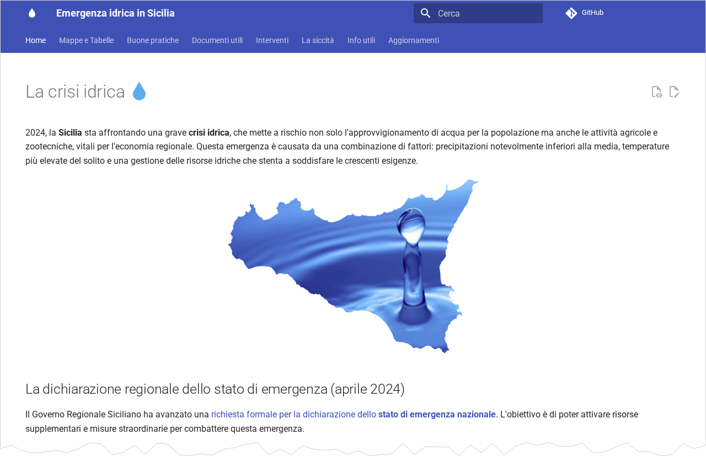
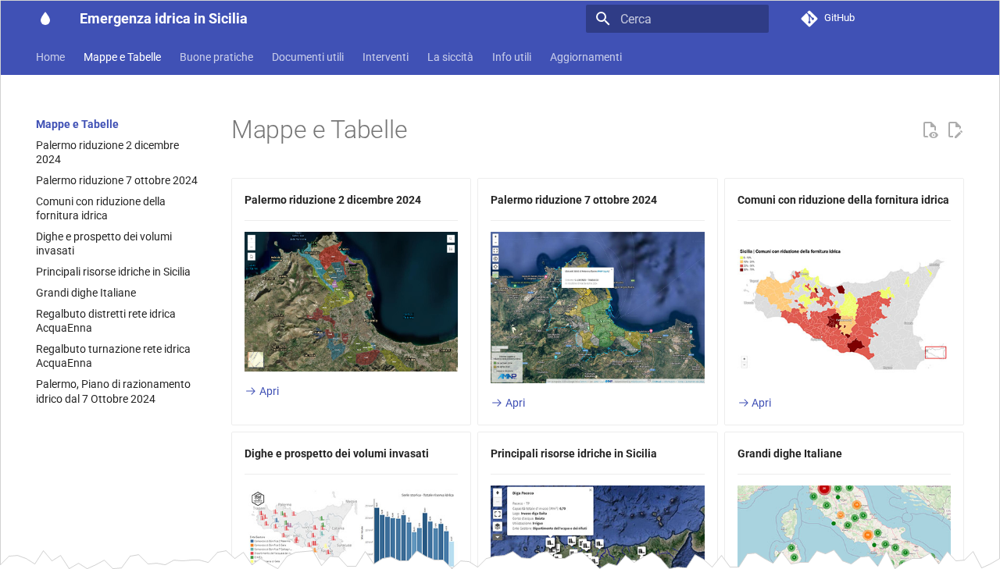
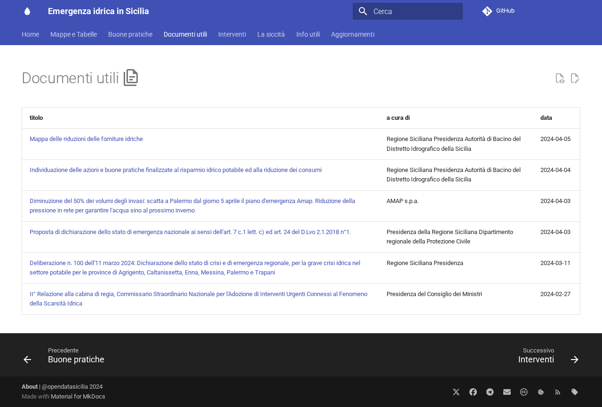

# Emergenza Idrica Sicilia: un racconto civico dei dati

*Documento preparato dalla comunità OpenDataSicilia per il team del progetto "Where'd the Water Go?"*

---

## Il contesto: una crisi annunciata

Nel 2024 la Sicilia ha affrontato una crisi idrica senza precedenti recenti. Non si è trattato di una catastrofe improvvisa, ma del punto di rottura di una fragilità strutturale che si trascina da decenni.

Le cause sono molteplici e intrecciate: precipitazioni significativamente inferiori alla media stagionale, temperature in costante rialzo, e un sistema di distribuzione idrica in stato di degrado avanzato. Secondo i dati ISTAT 2022, la Sicilia è la seconda regione italiana per perdite totali in distribuzione: il **51,6%** dell'acqua immessa in rete non raggiunge mai l'utente finale — 339,7 milioni di metri cubi di acqua dispersi ogni anno.

I numeri della crisi del 2024 parlano da soli. A settembre, 9 dei 29 invasi artificiali dell'isola erano praticamente vuoti (sotto l'1% della capacità), e 10 non raggiungevano il 4%. Le riserve totali erano dimezzate rispetto al 2023: solo 227 milioni di metri cubi disponibili su una capacità complessiva di oltre 1.000. Il governatore Renato Schifani ha richiesto lo stato di emergenza nazionale ad aprile 2024, rinnovato poi nel 2025.

Le conseguenze sulla vita quotidiana sono state pesanti. A Enna l'acqua arrivava nelle case ogni sei giorni. Ad Agrigento alcune aree erano servite da autobotti ogni 15 giorni. A Messina oltre 2.000 residenti avevano accesso all'acqua per sole tre ore ogni 5-7 giorni. In tutto, 140 dei 391 comuni siciliani — inclusa Palermo — hanno subito riduzioni della fornitura tra il 10% e il 70%.

---

## Il vuoto informativo

Di fronte a questa crisi, l'informazione istituzionale era frammentata, difficile da trovare e quasi impossibile da usare. I dati esistevano — nei report settimanali dell'Autorità di Bacino del Distretto Idrografico della Sicilia, nei verbali dell'Osservatorio Distrettuale Permanente sugli Utilizzi Idrici — ma erano sepolti in PDF non strutturati, distribuiti su portali diversi, privi di qualsiasi formato aperto o leggibile da una macchina.

Chi voleva capire l'andamento dei livelli degli invasi, la situazione per singolo comune o le decisioni adottate dall'osservatorio regionale, si trovava davanti a documenti PDF di decine di pagine, senza dati comparabili, senza storico accessibile, senza strumenti di navigazione.

Questo è il vuoto che OpenDataSicilia ha scelto di colmare.

---

## La risposta civica: OpenDataSicilia

[OpenDataSicilia](https://opendatasicilia.it) è una comunità aperta di cittadini, professionisti e attivisti siciliani nata nel 2013 con un obiettivo semplice: promuovere la cultura dei dati aperti come strumento di trasparenza e partecipazione democratica.

Non è un'organizzazione formale né un'azienda. È una rete di persone che condivide competenze — tecniche, giornalistiche, civiche — e le mette al servizio di problemi concreti. Quando la crisi idrica ha cominciato a diventare emergenza, la comunità si è chiesta: *cosa possiamo fare con i dati?*

L'aprile 2024 è stato il momento di risposta. In poche settimane è nato il progetto "Emergenza Idrica Sicilia": un repository pubblico su GitHub, un sito web, una pipeline automatizzata, e una comunità che si è messa a lavoro per trasformare PDF istituzionali in dati aperti, accessibili, riutilizzabili.

Da allora, in quasi due anni di attività continuativa, il progetto ha accumulato **733 commit** — misura concreta di un lavoro collettivo sostenuto nel tempo.

---

## Cosa è stato costruito

### I dataset

Il cuore del progetto sono i dati. Disponibili liberamente con licenza **CC-BY-4.0**, strutturati secondo lo standard Frictionless Data, pronti all'uso per chiunque voglia analizzarli, visualizzarli o integrarli in altre indagini.

**Volumi degli invasi siciliani — dato mensile**
Il dataset principale raccoglie i volumi invasati nelle **31 dighe siciliane** monitorate, con uno storico che parte dal **2007** e arriva ad agosto 2025. Quasi vent'anni di dati, estratti dai report ufficiali dell'Autorità di Bacino, ora disponibili come CSV aperto e confrontabile.

**Volumi degli invasi — dato giornaliero**
Per 14 delle dighe principali, i dati vengono aggiornati con frequenza giornaliera, con copertura dall'agosto 2023 al dicembre 2025. Questo permette di seguire in tempo quasi reale l'andamento dei livelli, di identificare variazioni anomale, di correlare i dati con gli eventi meteo.

**Anagrafica delle dighe**
Un dataset di riferimento con le informazioni di base su ciascuna diga: coordinate geografiche, capacità totale, gestore, codice identificativo. L'elemento fondamentale per contestualizzare qualsiasi analisi spaziale o comparativa.

**Riduzioni idriche per comune (aprile 2024)**
I dati sulle riduzioni della fornitura idrica disposte ad aprile 2024 per i comuni siciliani, con la percentuale di riduzione applicata. Un dataset che documenta l'impatto diretto della crisi sulla popolazione.

**Erogazione idrica a Regalbuto**
Un caso specifico, ma emblematico: i dati sul regime di turnazione idrica nel comune di Regalbuto (Enna), uno dei più colpiti dalla crisi, con indicazione degli orari e dei turni di erogazione.

### La pipeline automatizzata

Come si trasformano i PDF istituzionali in dati aperti? Il processo non è banale, e la risposta tecnica adottata dal progetto è sia innovativa che replicabile.

I report settimanali dell'Autorità di Bacino vengono pubblicati come PDF sul sito della Regione Siciliana. Un sistema automatico rileva la presenza di nuovi documenti. Questi vengono poi elaborati da un modello di linguaggio di grandi dimensioni (Google Gemini), che li "legge" e ne estrae i dati strutturati — volumi per diga, date, valori numerici — trasformandoli in righe di un CSV.

Il sistema non si fida ciecamente dell'estrazione: una doppia validazione verifica la coerenza dei dati prima che vengano integrati nel dataset principale. Solo se i dati superano i controlli, vengono pubblicati. Tutto il flusso è orchestrato tramite **GitHub Actions**, che esegue il processo automaticamente a cadenza periodica, senza intervento manuale.

Ogni aggiornamento genera una **notifica Telegram** alla comunità, che può così monitorare in tempo reale lo stato degli invasi e segnalare eventuali anomalie.

### Il sito pubblico

I dati grezzi sono utili per chi sa usarli. Ma per arrivare anche ai cittadini, ai giornalisti e agli amministratori, serviva qualcosa di più leggibile. Il sito [opendatasicilia.github.io/emergenza-idrica-sicilia](https://opendatasicilia.github.io/emergenza-idrica-sicilia) trasforma i dataset in strumenti di comunicazione.

Il sito contiene:

- **Mappe interattive** dei volumi invasati, delle risorse idriche regionali (dighe, laghi, fiumi), dei comuni soggetti a riduzione della fornitura, e dei distretti di Palermo con riduzione della pressione idrica gestiti da AMAP S.p.A.
- **Tabelle aggiornate** con i volumi delle dighe, consultabili e filtrabili
- **Riassunti dei verbali** dell'Osservatorio Distrettuale Permanente, generati automaticamente da un sistema AI che sintetizza i documenti ufficiali in testo leggibile
- **Documenti utili**: le ordinanze regionali, i piani di intervento, il vademecum per il risparmio idrico, gli interventi prioritari del PNRR
- **Aggiornamenti periodici** con comunicati e notizie sull'evoluzione della crisi

---

## Il valore civico

Il progetto non è un esercizio tecnico. È una risposta politica, nel senso più pieno del termine: una comunità che decide di non aspettare che le istituzioni rendano i dati accessibili, ma lo fa essa stessa, nell'interesse pubblico.

Ci sono almeno tre livelli di valore che questo lavoro produce.

**Trasparenza come strumento democratico.** I dati sugli invasi siciliani esistevano prima che OpenDataSicilia li raccogliesse. Ma esistere in un PDF non letto equivale a non esistere. Renderli aperti, confrontabili, storici — questo trasforma un documento amministrativo in un'infrastruttura di conoscenza collettiva.

**Infrastruttura per il giornalismo.** Un giornalista che vuole capire l'andamento degli invasi negli ultimi 18 anni non deve più chiedere accesso agli archivi regionali, estrarre dati a mano, costruirsi una base dati da zero. La trova già pronta, documentata, aggiornata, con licenza aperta. Questo è ciò che i dati aperti fanno al giornalismo investigativo: gli tolgono l'onere della raccolta e gli permettono di concentrarsi sull'analisi e sul racconto.

**La comunità come soggetto supplente.** In un contesto in cui le istituzioni pubblicano dati in formati non usabili, in cui i tempi di aggiornamento sono discontinui, in cui la frammentazione dei gestori rende impossibile una visione d'insieme, una comunità civica che aggrega, standardizza e pubblica è un soggetto essenziale — non sostitutivo delle istituzioni, ma pressante verso di esse.

---

## I numeri del progetto

| Indicatore | Valore |
|---|---|
| Commit dal lancio (aprile 2024) | 733 |
| Dighe monitorate | 31 |
| Periodo coperto (mensile) | 2007 – agosto 2025 |
| Periodo coperto (giornaliero) | agosto 2023 – dicembre 2025 |
| Licenza dati | CC-BY-4.0 |
| Formato | CSV aperto, standard Frictionless Data |

---

## Come il progetto può supportare "Where'd the Water Go?"

Il team di OpenDataSicilia è direttamente coinvolto nel progetto "Where'd the Water Go?" (Andrea Borruso, presidente di Ondata e fondatore di OpenDataSicilia, e Dennis Angemi, fisico e attivista dell'Osservatorio Civico del Simeto, fanno parte del team). Questo non è un rapporto tra fornitore e cliente, ma una collaborazione tra soggetti che condividono la stessa visione: la trasparenza dei dati come strumento di giustizia.

In termini pratici, il progetto mette a disposizione:

- **Dataset pronti all'uso** — nessuna necessità di richiedere accesso, pulire dati o ricostruire storici
- **Le sorgenti primarie già identificate** — i report dell'Autorità di Bacino, i verbali dell'Osservatorio, le ordinanze regionali
- **Una pipeline replicabile** — il metodo di estrazione da PDF con LLM può essere esteso ad altri documenti istituzionali che il progetto giornalistico incontrerà
- **Una rete di contatti** — la comunità OpenDataSicilia ha relazioni con tecnici, amministratori, esperti del settore idrico che possono essere utili come fonti o come validatori
- **Continuità** — il progetto continua ad aggiornarsi; i dati che il team "Where'd the Water Go?" userà sono costantemente arricchiti

---

## Il sito come racconto

Il repository è l'infrastruttura — i dati grezzi, gli script, la pipeline. Ma il racconto vive nel sito. È lì che i numeri diventano leggibili, che la crisi prende forma visiva, che un cittadino o un giornalista può navigare l'emergenza senza sapere cos'è un CSV.

Il sito [opendatasicilia.github.io/emergenza-idrica-sicilia](https://opendatasicilia.github.io/emergenza-idrica-sicilia) è costruito con Material for MkDocs: semplice, veloce, accessibile da qualsiasi dispositivo. Ogni sezione ha un ruolo preciso nel racconto complessivo.

---

### La home: perché esiste questo posto

La pagina iniziale non ha fronzoli. Spiega subito perché il sito esiste: c'è una crisi, i dati ci sono ma sono inaccessibili, OpenDataSicilia ha deciso di cambiarle forma. Elenca gli output del progetto come una lista di azioni concrete — non promesse, ma cose già fatte. È una dichiarazione di intenti che è anche una documentazione di risultati.

---

### Mappe e tabelle: la crisi resa visibile

È la sezione più densa e più usata. Nove visualizzazioni interattive che rispondono a domande diverse, presentate come una galleria di card navigabili.

**Dove sono le dighe e quanto contengono?** La dashboard Tableau mostra la mappa di tutte le dighe siciliane con le serie storiche dei volumi dal 2010 ad oggi. Si può cliccare su una singola diga e vedere come il suo livello sia cambiato negli anni, come il 2024 si confronti con il 2007 o il 2017. Non è una foto, è un film.

**Quali comuni sono stati tagliati?** La mappa delle riduzioni idriche del 5 aprile 2024 mostra con un colore a quale percentuale di riduzione è stato soggetto ciascun comune siciliano. Accanto, la mappa dei comuni che hanno emesso ordinanze per il risparmio idrico. Due strati dello stesso problema: il razionamento imposto dall'alto e quello adottato dal basso.

**Cosa succede a Palermo?** Due mappe separate documentano il piano di razionamento AMAP nella città: i distretti soggetti a riduzione della pressione idrica (ottobre 2024 e dicembre 2024), con i calendari di turnazione. Palermo è la città più grande dell'isola, e la sua gestione idrica è una storia a sé — queste mappe la rendono trasparente.

**Regalbuto, un caso estremo.** Comune di 7.000 abitanti in provincia di Enna, Regalbuto è diventato un simbolo della crisi: acqua disponibile poche ore al giorno, turnazioni rigide per distretto. Il sito dedica una sezione specifica alla turnazione AcquaEnna, con i calendari per zona. Non è un caso di studio astratto — è documentazione di come si vive quando l'acqua non è garantita.

**Le risorse idriche dell'isola.** Una mappa uMap su base OpenStreetMap geolocalizza tutte le principali risorse: dighe, laghi, fiumi. Il contesto geografico che permette di capire dove l'acqua c'è — o non c'è.

---

### Buone pratiche: parlare ai cittadini

Una sezione che potrebbe sembrare ovvia, ma che ha una logica precisa. Il vademecum — basato sull'ordinanza commissariale del 4 aprile 2024 — non è una lista di ovvietà: è un documento ufficiale trasformato in testo leggibile. L'originale era un PDF burocratico. Qui diventa una pagina con numeri concreti (30 litri sprecati lasciando il rubinetto aperto mentre ci si lava i denti; 100-160 litri per un bagno contro 40 per una doccia), 24 buone pratiche pratiche e contestualizzate.

È la sezione che si rivolge non a chi analizza i dati, ma a chi li subisce: i cittadini. E li tratta come adulti capaci di cambiare comportamento se si spiega loro il perché.

---

### Documenti utili: la memoria istituzionale

I documenti ufficiali esistono — ordinanze, delibere, piani d'emergenza, richieste di stato di emergenza nazionale — ma sono sparsi su portali diversi, con URL instabili e formati non indicizzabili. Questa sezione li raccoglie, li nomina in modo comprensibile, e li rende scaricabili con un click.

Sei documenti chiave del 2024: dalla mappa delle riduzioni idriche all'ordinanza per il risparmio, dal piano AMAP al decreto di stato d'emergenza regionale, dalla relazione della cabina di regia commissariale alla deliberazione della crisi. È un archivio civico che supplisce all'assenza di un archivio istituzionale organizzato.

---

### Interventi: cosa si sta facendo (e con quali soldi)

Una sezione spesso trascurata nel racconto della crisi, ma essenziale per capirla davvero: non basta sapere che le dighe sono vuote, bisogna sapere quali interventi sono previsti, chi li deve fare, e quanto costano.

La pagina raccoglie due fonti distinte. La prima è la relazione del Commissario Straordinario Nazionale per la scarsità idrica (febbraio 2024): 27 interventi prioritari per la Sicilia, per un totale di **829 milioni di euro**. Interconnessioni tra dighe, sfangamenti degli invasi, manutenzioni straordinarie, sistemi di telecontrollo. I numeri sono grossi, i soggetti attuatori sono tanti (Consorzi di Bonifica, Dipartimento Regionale dell'Acqua, Siciliacque SpA), e il documento originale era un PDF di centinaia di pagine. Qui è una tabella navigabile.

La seconda fonte sono i progetti PNRR finanziati alla Sicilia nelle misure 4.1 (infrastrutture primarie) e 4.2 (riduzione perdite di rete), estratti dai decreti di finanziamento del MIT. Anche questi erano dati sepolti in decreti ministeriali. Ora sono una tabella interattiva, consultabile e comparabile.

Questa sezione risponde alla domanda: "ma qualcuno fa qualcosa?" — e permette di valutare se quello che si fa è proporzionato al problema.

---

### La siccità: il contesto scientifico

Una pagina breve ma necessaria. Il sito non è un portale di ricerca scientifica, ma chi arriva qui cercando capire ha bisogno di una bussola. La sezione distingue i quattro tipi di siccità (meteorologica, agricola, idrologica, socio-economica) e rimanda ai due strumenti di monitoraggio più autorevoli: l'Osservatorio Siccità del CNR e il Copernicus Drought Observatory europeo.

È un riconoscimento che la crisi ha radici scientifiche che vanno oltre la gestione idrica — e che i dati aperti dialogano con la ricerca.

---

### Info utili: navigare le fonti primarie

Una pagina per chi vuole andare alla sorgente. Raggruppa i link istituzionali che contano: la pagina della Regione Siciliana sullo stato d'emergenza, i verbali dell'Osservatorio Distrettuale, i report siccità, i dati meteo della Protezione Civile regionale, l'Osservatorio Siccità CNR, ISPRA, il JRC europeo. E poi i comunicati delle aziende idriche — AMAP, AcquaEnna, AICA Agrigento, Caltacqua, Siciliacque — con i feed RSS dove disponibili.

È la sezione per il giornalista, il ricercatore, il funzionario che vuole verificare i dati alla fonte primaria invece di fidarsi della mediazione. Un atto di trasparenza metodologica.

---

### Aggiornamenti: la fase redazionale

Nella prima fase del progetto — dall'aprile 2024 al maggio 2025 — il sito ha avuto anche una dimensione editoriale attiva. Oltre 40 articoli pubblicati nel blog, che documentavano l'evoluzione della crisi in tempo quasi reale.

I verbali dell'Osservatorio Distrettuale venivano riassunti automaticamente da un sistema AI e pubblicati come articoli leggibili — visibili nel sito come box evidenziati, con la trasparenza di indicare la fonte automatica. I comunicati delle aziende idriche venivano selezionati e contestualizzati. Le decisioni della cabina di regia tradotte in notizie.

Questa attività redazionale si è progressivamente ridotta fino a fermarsi. Ma il progetto non si è fermato: la parte che è rimasta viva — e che continua ad aggiornarsi fino ad oggi — è l'estrazione automatica dei dati sugli invasi e sulle dighe. I dataset vengono aggiornati con regolarità, l'ultimo aggiornamento risale a febbraio 2026.

È una distinzione importante: la produzione di contenuto editoriale richiede energie umane continue; la pipeline dati, una volta costruita e validata, lavora in autonomia. Il risultato è un archivio che cresce nel tempo, indipendentemente dall'attività redazionale.

---

## Riferimenti e risorse

- Repository GitHub: [github.com/opendatasicilia/emergenza-idrica-sicilia](https://github.com/opendatasicilia/emergenza-idrica-sicilia)
- Sito pubblico: [opendatasicilia.github.io/emergenza-idrica-sicilia](https://opendatasicilia.github.io/emergenza-idrica-sicilia)
- Dataset principale (volumi mensili): `risorse/sicilia_dighe_volumi.csv`
- Dataset giornaliero: `risorse/sicilia_dighe_volumi_giornalieri.csv`
- Anagrafica dighe: `risorse/sicilia_dighe_anagrafica.csv`
- Fonte istituzionale primaria: Autorità di Bacino del Distretto Idrografico della Sicilia
